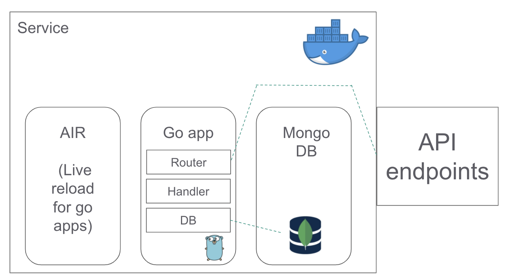

# ToDoApp-Backend

### ToDoApp
This application is a digital version of a `ToDo list` that keeps all your 'To Do' tasks in one place. The application comprises of a backend, written in [go-fiber](https://gofiber.io/) with [mongodb](https://www.mongodb.com/) serving as the database service, and a frontend written in [react](https://reactjs.org/). 
With this application you can perform the basic functions of creating, updating and deleting tasks along with marking them done and viewing the list of already created tasks.

### Frontend
The frontend can be found [here](https://github.com/HassaanTS/ToDoApp-FrontEnd/tree/develop).

### Architecture
- The configurator loads the environment variables and makes them available for the application, the database handler and the request handler
- The router creates end-points that expose the application to the outside world
- Handlers handle the requests made to the server on these end-points and perform CRUD operations on the database
- The database connections are made and closed on each operation to prevent stale database handles


### API
The application provides an interface to various interactions with the database. These are accessed through the endpoints. Each endpoint has some actions associated to them. They are described as follows:
| Endpoint      | Request | Response/Input |
| ----------- | ----------- | ----------- |
| api/v1 | GET | Responds with an alive message string |
| api/v1/get_todos | GET | Responds with JSON object containing a list of records |
| api/v1/create_todo | POST | Input JSON object containing 'title', 'desc', 'date' and 'done' |
| api/v1/update_todo/`todo_id` | PUT | Input JSON object containing the field that needs to be updated along with a value for the given `todo_id` record|
| api/v1/delete_todo/`todo_id` | DELETE | Deletes record for the given `todo_id`|

#### Deployment
The application can be accessed in a number of different ways
- Docker:
There is a docker-compose file that orchestrates the application container built from the Dockerfile along with `mongodb` and `air`(Live reload for Go apps). If you're running the project for the first time you can run the following command:
```
docker-compose up --build

// thereafter, simply run 
docker-compose up
```
- Run in the project directory:
```
go run main.go
```
 - Build and execute the application:
```
go build -o bin/todo

cd bin
./todo
```

#### Environment Variables
The environment is defined in the `.env` file.
 - APP_PORT: The port that the application will listen on
 - MONGODB_HOSTNAME: The hostname of the mongodb service
 - MONGODB_PORT: The port of the mongodb service
 - MONGODB_NAME: The name of the mongodb database
 - MONGODB_COLLECTION: The name of the collection inside the mongodb database
